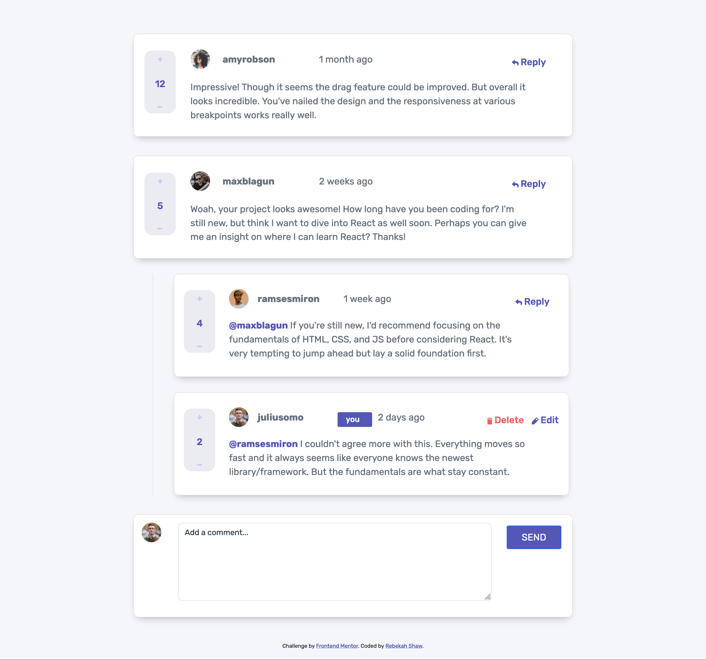
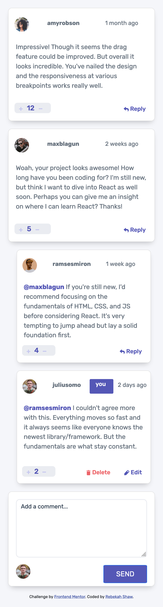

# Frontend Mentor - Interactive comments section solution

This is a solution to the [Interactive comments section challenge on Frontend Mentor](https://www.frontendmentor.io/challenges/interactive-comments-section-iG1RugEG9). Frontend Mentor challenges help you improve your coding skills by building realistic projects.

## Table of contents

- [Overview](#overview)
  - [The challenge](#the-challenge)
  - [Screenshot](#screenshot)
  - [Links](#links)
- [My process](#my-process)
  - [Built with](#built-with)
  - [What I learned](#what-i-learned)
  - [Continued development](#continued-development)
  - [Useful resources](#useful-resources)
- [Author](#author)

## Overview

### The challenge

Users should be able to:

- View the optimal layout for the app depending on their device's screen size
- See hover states for all interactive elements on the page
- Create, Read, Update, and Delete comments and replies
- Upvote and downvote comments
- **Bonus**: If you're building a purely front-end project, use `localStorage` to save the current state in the browser that persists when the browser is refreshed.
- **Bonus**: Instead of using the `createdAt` strings from the `data.json` file, try using timestamps and dynamically track the time since the comment or reply was posted.

### Screenshot

#### Desktop



#### Mobile



### Links

- Solution URL: [Solution](https://github.com/rebekahshaw92//interactive-comments-section)
- Live Site URL: [Live Site](https://rebekahshaw92.github.io//interactive-comments-section/)

### Built with

- Semantic HTML5 markup
- CSS custom properties
- Sass
- JavaScript
- Bootstrap 5
- Mobile-first workflow

### What I learned

I found this project to be quite a challenge.  While doing this project I learned a number of new skills within JavaScript.

1. First I learned how to get JSON data and display it in the dom using fetch


``` JS
fetch('./data.json', {
    method: 'GET',
    headers: {
        'Accept': 'application/json',
    },
})
    .then((response) => response.json())
        .then((data) => {
            currentUser = data.currentUser;
            comments = data.comments;          
    })
     .catch((error) => {
         console.log(error);
     })

```

2. I learned how to loop over JSON data to find the part of the data you want to display in the DOM. 

``` JS
comments[1].replies[1].score

```

3. I then learned how to find the closest elements with in the DOM using closest as shown in the following code

``` JS
 const updText = e.target.closest('.current_user').querySelector('.cardComment');

```

4. Lastly I learned how to remove a string from a string value using slice as shown below.

``` JS

 const restString = username.slice(1).join(' ');

 ```

 ### Continued Development

 I would liked to learn how to use localStorage in order to store the data (new comment) the user has added.

 ### Userful Resources 

- [Bootstrap](https://getbootstrap.com) - This site helped me learn all I needed to know about Bootstrap.


## Author

- Website - [Rebekah Shaw](https://www.rebekahshaw.com)
- Frontend Mentor - [@rebekahshaw92](https://www.frontendmentor.io/profile/rebekahshaw92)
- Twitter - [@x_beckyboo_x](https://www.twitter.com/x_beckyboo_x)
